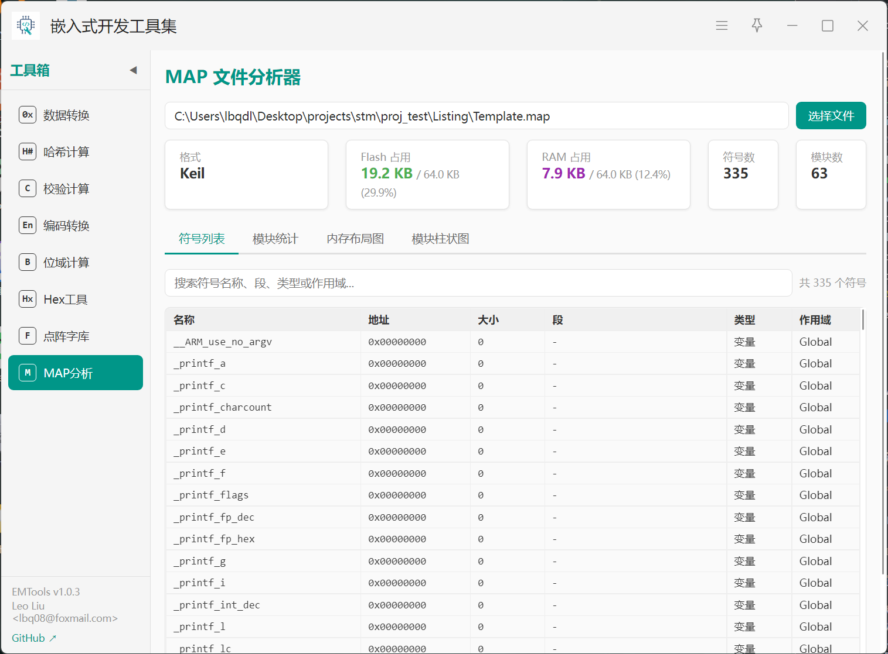
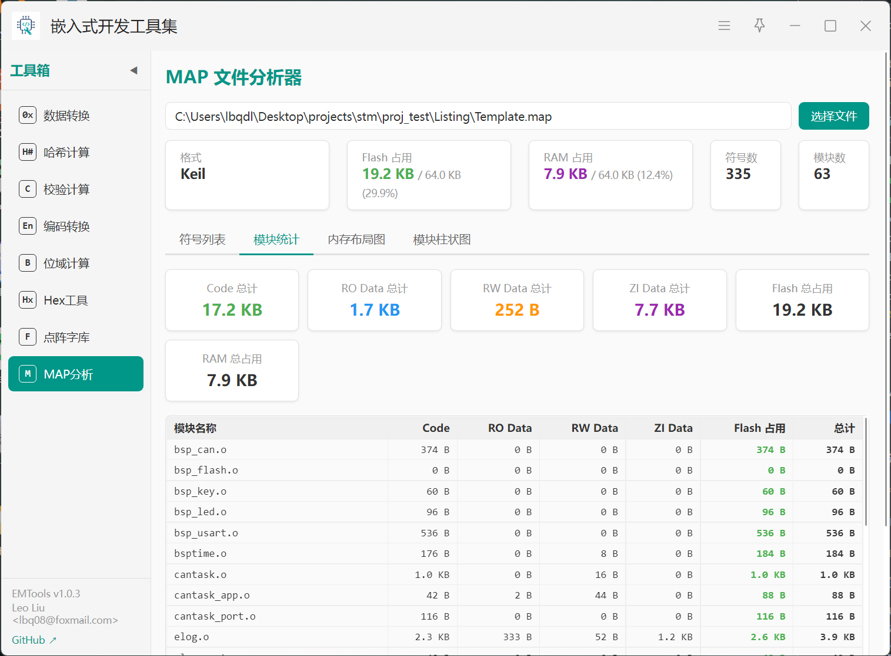
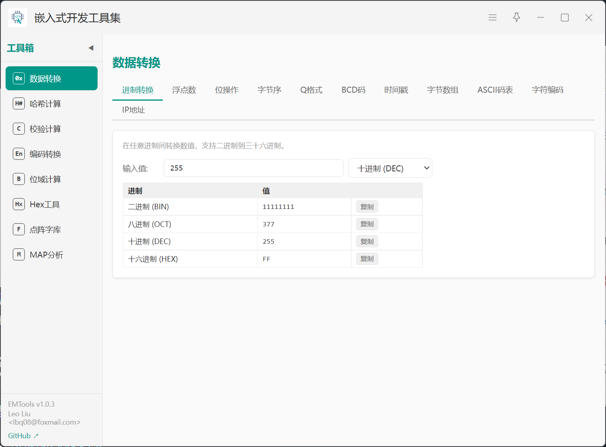

# EMTools — 嵌入式开发工具箱

> uTools 插件，专为嵌入式工程师打造的日常工具集。把数据转换、校验计算、固件处理、字库生成、内存分析整合在一个面板里，敲几个关键字就能调出。

[](https://github.com/causebefore/EMTools/actions/workflows/ci.yml)
[](./LICENSE)

## 简介

EMTools 是一个集成在 uTools 里的嵌入式开发工具箱，包含数据转换、CRC/哈希计算、编码转换、Hex 编辑器、点阵字库生成器、MAP 文件分析器等实用工具。它旨在帮助工程师提高效率，减少在多个工具之间切换的麻烦。

欢迎 Star&Fork ：[https://github.com/causebefore/EMTools](https://github.com/causebefore/EMTools)

## 使用场景

嵌入式开发中，工程师频繁在数据手册、IDE、命令行和在线工具之间切换——查 ASCII 表、算 CRC、转大小端、解析 HEX 文件、生成点阵字库。EMTools 把这些操作整合到 uTools 里，Alt+Space 唤起，用完即走，不用再开浏览器翻在线工具。

## 核心功能

### Hex 工具

固件工程师最常用的工具。支持三种格式：

- **Hex 编辑器**：Canvas 渲染的十六进制网格，支持单击选中、双击编辑、修改标红。偏移地址栏 + 十六进制区 + ASCII 视图三栏布局
- **格式互转**：Intel HEX ↔ Motorola S19 ↔ Binary 任意转换，自动检测文件格式
- **搜索**：Hex 搜索支持 `??` 通配符模式（如搜索 `FF 00 ??`），ASCII 搜索支持纯文本
- **文件操作**：切片（按地址范围裁剪）、填充（指定值填充到目标大小）、合并（按地址拼接或顺序拼接）
- **拖入即用**：拖入 `.hex` `.bin` `.s19` `.srec` `.mot` 文件自动唤起

### 点阵字库生成器

OLED/LCD 屏幕开发必备：

- **取模设置**：阴码/阳码、逐列/逐行/行列/列行四种扫描模式、LSB/MSB 位方向
- **分辨率**：支持 12×12、16×16、24×24、32×32
- **字形渲染**：可选字体（宋体/雅黑/黑体/等线/苹方）、粗体、偏移微调、二值阈值
- **实时预览**：Canvas 像素级预览，修改参数即时看到效果
- **内置字符集**：默认常用中文、数字字母、符号、单位、日期时间等
- **导出**：C 头文件（含二分查找函数）、二进制（索引+数据分离）
- **从文件加载**：支持从文本文件读入自定义字符集

### MAP 文件分析器




链接器生成的 MAP 文件动辄几百 KB，手动翻找符号和模块极其痛苦。MAP 分析器自动解析：

- **格式支持**：GCC/ARM LD、Keil MDK、IAR 三种编译器 MAP 格式，自动检测
- **解析引擎**：在 Node.js 预加载层执行，大文件不阻塞 UI
- **符号列表**：表格展示所有符号的名称、地址、大小、所属段、类型（函数/变量）、作用域。支持搜索和排序
- **模块统计**：按体积降序排列，一眼找到固件中的"空间大户"
- **内存布局图**：Canvas 绘制 Flash 和 RAM 堆叠柱状图，Code（绿）、RO Data（蓝）、RW Data（橙）、ZI Data（紫）、空闲（灰），占比一目了然
- **模块柱状图**：Top 20 模块体积可视化

### 数据转换



11 个子功能的一站式转换器：

| 子功能     | 说明                                                        |
| ---------- | ----------------------------------------------------------- |
| 进制转换   | 2-36 进制任意互转                                           |
| IEEE 754   | 浮点数 ↔ 十六进制，单/双精度，符号/指数/尾数分解            |
| 位操作     | 与/或/异或/非/位移/置位/清零/翻转/提取，BigInt 支持 64 位   |
| 字节序     | 大小端互转（16/32/64 位），字节反转                         |
| Q 格式     | 定点数与浮点数互转                                          |
| BCD 码     | BCD ↔ 十进制 ↔ 十六进制                                     |
| 时间戳     | Unix 时间戳 ↔ 日期，秒/毫秒切换                             |
| 字节数组   | Hex 字符串 → C 数组格式化                                   |
| ASCII 码表 | 128 字符参考表，搜索过滤                                    |
| 字符编码   | Unicode/UTF-8/UTF-16 编码 + 单字符转换 + 字符串批量转 ASCII |
| IP 地址    | IP ↔ 整数 ↔ 十六进制 ↔ 二进制                               |

### 校验计算

- **CRC 校验**：7 种预设（CRC-8、CRC-8/MAXIM、CRC-16/MODBUS、CRC-16/CCITT、CRC-16/XMODEM、CRC-32、CRC-32/MPEG-2），支持自定义参数（位宽/多项式/初始值/输入反转/输出反转/输出异或），一键生成查表法 C 代码
- **文件 CRC**：选择文件直接计算，支持偏移和长度范围
- **C 代码生成**：完整的查表法实现，包括查找表和计算函数

### 哈希计算器

- **算法**：MD5、SHA-1、SHA-256、SHA-512
- **文本模式**：输入即算，实时展示
- **文件模式**：Node.js crypto 流式计算，大文件无压力

### 编码转换

- **编解码**：GBK / GB2312 / GB18030 ↔ UTF-8 ↔ UTF-16 LE/BE ↔ ISO-8859-1 ↔ ASCII
- **文件检测**：jschardet 自动检测文件编码，显示置信度
- **批量转换**：选择目录递归扫描，自动去除非 UTF-8 文件并转码

### 位域计算器

- **可视化**：Canvas 渲染 8/16/32/64 位寄存器，每位可点击翻转。位域用不同颜色区分，虚线分隔，图例标注
- **模板加载**：内置 GPIO 控制寄存器模板，加载后自动着色
- **编辑**：直接在十六进制输入框中修改，或点击位翻转

## 安装

### 1. 使用 release 包安装

1. 安装 [uTools](https://u.tools)
2. 下载 `EMTools_v1.0.3.upx` 双击安装
3. 或克隆仓库本地开发模式加载（见下方开发说明）

### 2. 在 uTools 中搜索安装

1. 打开 uTools，进入插件市场
2. 搜索 `嵌入式开发工具集`
3. 点击安装
   

## 使用方式

在 uTools 搜索框输入关键字直接唤起对应工具：

| 功能     | 输入关键词                                     |
| -------- | ---------------------------------------------- |
| 完整面板 | `emtools` `嵌入式工具箱` `工具箱`              |
| 数据转换 | `数据转换` `进制转换` `IEEE754` `大小端` `BCD` |
| 哈希计算 | `哈希` `hash` `MD5` `SHA` `SHA256`             |
| CRC 校验 | `CRC` `CRC校验` `CRC计算`                      |
| 编码转换 | `编码转换` `GBK` `UTF8转换`                    |
| 位域计算 | `位域` `寄存器` `bitfield` `位域计算`          |
| Hex 工具 | `Hex工具` `hex` `固件工具`                     |
| 点阵字库 | `字库` `点阵` `字库生成`                       |
| MAP 分析 | `MAP分析` `MAP` `内存分析` `固件分析`          |

**文件拖入匹配**：拖入文件自动唤起对应工具：

- `.hex` `.bin` `.s19` `.srec` `.mot` → Hex 工具
- `.map` → MAP 分析器
- `.c` `.h` `.cpp` `.txt` 等文本文件 → 编码检测

## 技术架构

```txt
src/
├── views/           # 8 个工具页面，按需懒加载
├── components/      # 可复用组件（HexViewer Canvas 网格、RegisterVisualizer Canvas 寄存器）
├── utils/           # 纯 JS 算法模块，无 UI 依赖
public/
├── plugin.json      # uTools 插件配置（9 个 feature 入口）
└── preload/         # Node.js 预加载层
    ├── services.js  # 文件 I/O、crypto 哈希、编码转换桥接
    └── map_parser.js # GCC/Keil/IAR MAP 解析器
```

- **前端**：Vue 3 + Vite
- **预加载层**：Node.js（iconv-lite 编码转换、jschardet 编码检测、crypto 哈希）
- **测试**：Node.js 原生 `node:test`
- **宿主**：uTools 插件体系（Electron + Chromium）

## 开发

```bash
# 安装依赖（含 preload 子目录）
npm install
npm --prefix public/preload install

# 启动开发服务器
npm run dev          # http://localhost:5173

# 构建生产包
npm run build        # → dist/

# 打包 .upx
# 将 dist/ 内所有文件压缩为 zip，改后缀为 .upx

# 运行测试
npm test
```

uTools 开发模式下，`plugin.json` 中 `development.main` 指向 `http://localhost:5173`，启动 dev server 后即可在 uTools 中加载。

## 开源协作

欢迎通过 Issue 和 Pull Request 参与改进 EMTools。

默认开发分支为 `dev`，`main` 主要用于稳定版本发布与归档。

- 提交缺陷或需求前，请先阅读 [贡献指南](./CONTRIBUTING.md)
- 协作行为规范见 [行为准则](./.github/CODE_OF_CONDUCT.md)
- 安全漏洞请按 [安全策略](./.github/SECURITY.md) 私下报告
- 使用帮助和提问方式见 [支持说明](./.github/SUPPORT.md)

## 未来计划

- **功能扩展**：增加更多实用工具，如寄存器配置生成器、内存映射可视化、在线文档快速访问等
- **性能优化**：进一步提升大文件处理速度，优化 UI 响应
- **用户体验**：增加主题支持、界面自定义、更多预设选项
- **桌面端支持**：增加 Electron 独立应用版本，脱离 uTools 也能使用

## 作者

Leo Liu <lbq08@foxmail.com>

GitHub: [causebefore/EMTools](https://github.com/causebefore/EMTools)

## License

该项目采用 MIT 许可证，详见 [LICENSE](./LICENSE) 文件。
