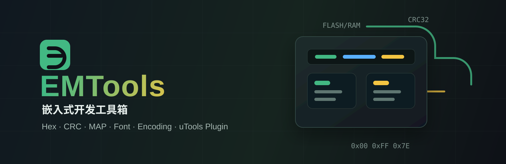

<p align="center">
  
</p>

<h1 align="center">EMTools 嵌入式开发工具箱</h1>

<p align="center">
  面向嵌入式工程师的 uTools 插件，把 Hex 处理、CRC 校验、MAP 分析、点阵字库、编码转换等高频工具收进一个面板。
</p>

<p align="center">
  <a href="https://github.com/causebefore/EMTools/actions/workflows/ci.yml">
    
  </a>
  
  
  
  <a href="./LICENSE">
    
  </a>
</p>

<p align="center">
  <a href="#为什么需要-emtools">为什么需要</a> ·
  <a href="#核心功能">核心功能</a> ·
  <a href="#界面预览">界面预览</a> ·
  <a href="#安装">安装</a> ·
  <a href="#开发">开发</a>
</p>

## 为什么需要 EMTools

嵌入式开发里，工程师经常在数据手册、IDE、命令行和在线工具之间来回切换：查 ASCII 表、算 CRC、转大小端、解析 HEX 文件、生成点阵字库、分析 MAP 体积。EMTools 把这些操作整合到 uTools 里，`Alt + Space` 唤起，用完即走。

项目地址：[causebefore/EMTools](https://github.com/causebefore/EMTools)

## 核心功能

| 工具 | 能做什么 | 适合场景 |
| --- | --- | --- |
| Hex 工具 | BIN / Intel HEX / Motorola S19 查看、搜索、编辑、转换、切片、填充、合并 | 固件文件处理、烧录前检查 |
| CRC 校验 | 预设 CRC、自定义参数、文件 CRC、查表法 C 代码生成 | 通信协议调试、固件校验 |
| MAP 分析器 | GCC / Keil / IAR MAP 解析、符号列表、模块统计、内存布局图 | 固件体积优化、空间占用排查 |
| 点阵字库生成器 | 中文取模、扫描模式、位方向、实时预览、C 头文件导出 | OLED / LCD 字库生成 |
| 数据转换 | 进制、IEEE 754、位操作、字节序、Q 格式、BCD、时间戳、ASCII、IP 转换 | 日常数据换算 |
| 编码转换 | GBK / GB2312 / GB18030 / UTF-8 / UTF-16 / ISO-8859-1 检测与转换 | 老工程文本处理、批量转码 |
| 哈希计算器 | MD5、SHA-1、SHA-256、SHA-512，支持文本和文件模式 | 文件完整性校验 |
| 位域计算器 | 8 / 16 / 32 / 64 位寄存器可视化、位翻转、模板加载 | 寄存器配置和调试 |

## 界面预览

| MAP 文件分析器 | 模块统计 |
| --- | --- |
|  |  |

| 数据转换 | 插件市场安装 |
| --- | --- |
|  |  |

## 功能详情

### Hex 工具

固件工程师最常用的工具，支持三种格式：

- **Hex 编辑器**：Canvas 渲染十六进制网格，支持单击选中、双击编辑、修改标红。偏移地址栏、十六进制区、ASCII 视图三栏布局。
- **格式互转**：Intel HEX、Motorola S19、Binary 任意转换，自动检测文件格式。
- **搜索**：Hex 搜索支持 `??` 通配符模式，例如 `FF 00 ??`；ASCII 搜索支持纯文本。
- **文件操作**：切片、填充、合并，支持按地址拼接或顺序拼接。
- **拖入即用**：拖入 `.hex`、`.bin`、`.s19`、`.srec`、`.mot` 文件自动唤起。

### 点阵字库生成器

OLED / LCD 屏幕开发必备：

- **取模设置**：阴码 / 阳码、逐列 / 逐行 / 行列 / 列行四种扫描模式、LSB / MSB 位方向。
- **分辨率**：支持 12x12、16x16、24x24、32x32。
- **字形渲染**：可选字体、粗体、偏移微调、二值阈值。
- **实时预览**：Canvas 像素级预览，修改参数即时看到效果。
- **内置字符集**：默认常用中文、数字字母、符号、单位、日期时间等。
- **导出**：C 头文件，含二分查找函数；也支持索引和数据分离的二进制格式。
- **从文件加载**：支持从文本文件读入自定义字符集。

### MAP 文件分析器

链接器生成的 MAP 文件动辄几百 KB，手动翻找符号和模块极其痛苦。MAP 分析器会自动解析：

- **格式支持**：GCC / ARM LD、Keil MDK、IAR 三种编译器 MAP 格式，自动检测。
- **解析引擎**：在 Node.js 预加载层执行，大文件不阻塞 UI。
- **符号列表**：表格展示符号名称、地址、大小、所属段、类型、作用域，支持搜索和排序。
- **模块统计**：按体积降序排列，一眼找到固件中的空间大户。
- **内存布局图**：Canvas 绘制 Flash 和 RAM 堆叠柱状图，Code、RO Data、RW Data、ZI Data、空闲占比一目了然。
- **模块柱状图**：Top 20 模块体积可视化。

### 数据转换

11 个子功能的一站式转换器：

| 子功能 | 说明 |
| --- | --- |
| 进制转换 | 2-36 进制任意互转 |
| IEEE 754 | 浮点数和十六进制互转，单 / 双精度，符号 / 指数 / 尾数分解 |
| 位操作 | 与、或、异或、非、位移、置位、清零、翻转、提取，BigInt 支持 64 位 |
| 字节序 | 大小端互转，支持 16 / 32 / 64 位，支持字节反转 |
| Q 格式 | 定点数与浮点数互转 |
| BCD 码 | BCD、十进制、十六进制互转 |
| 时间戳 | Unix 时间戳和日期互转，支持秒 / 毫秒切换 |
| 字节数组 | Hex 字符串转 C 数组格式 |
| ASCII 码表 | 128 字符参考表，支持搜索过滤 |
| 字符编码 | Unicode / UTF-8 / UTF-16 编码，支持单字符转换和字符串批量转 ASCII |
| IP 地址 | IP、整数、十六进制、二进制互转 |

### 校验计算

- **CRC 校验**：7 种预设，包括 CRC-8、CRC-8/MAXIM、CRC-16/MODBUS、CRC-16/CCITT、CRC-16/XMODEM、CRC-32、CRC-32/MPEG-2。
- **自定义参数**：支持位宽、多项式、初始值、输入反转、输出反转、输出异或。
- **文件 CRC**：选择文件直接计算，支持偏移和长度范围。
- **C 代码生成**：一键生成完整查表法实现，包括查找表和计算函数。

### 哈希计算器

- **算法**：MD5、SHA-1、SHA-256、SHA-512。
- **文本模式**：输入即算，实时展示。
- **文件模式**：Node.js crypto 流式计算，大文件无压力。

### 编码转换

- **编解码**：GBK / GB2312 / GB18030、UTF-8、UTF-16 LE / BE、ISO-8859-1、ASCII。
- **文件检测**：jschardet 自动检测文件编码，显示置信度。
- **批量转换**：选择目录递归扫描，自动找出非 UTF-8 文件并转码。

### 位域计算器

- **可视化**：Canvas 渲染 8 / 16 / 32 / 64 位寄存器，每位可点击翻转。
- **位域标注**：位域用不同颜色区分，虚线分隔，图例标注。
- **模板加载**：内置 GPIO 控制寄存器模板，加载后自动着色。
- **编辑**：直接在十六进制输入框中修改，或点击位翻转。

## 安装

### 使用 Release 包安装

1. 安装 [uTools](https://u.tools)
2. 下载最新 Release 的 `.upx` 文件
3. 双击 `.upx` 文件安装

### 在 uTools 中搜索安装

1. 打开 uTools，进入插件市场
2. 搜索 `嵌入式开发工具集`
3. 点击安装

## 使用方式

在 uTools 搜索框输入关键字直接唤起对应工具：

| 功能 | 输入关键词 |
| --- | --- |
| 完整面板 | `emtools`、`嵌入式工具箱`、`工具箱` |
| 数据转换 | `数据转换`、`进制转换`、`IEEE754`、`大小端`、`BCD` |
| 哈希计算 | `哈希`、`hash`、`MD5`、`SHA`、`SHA256` |
| CRC 校验 | `CRC`、`CRC校验`、`CRC计算` |
| 编码转换 | `编码转换`、`GBK`、`UTF8转换` |
| 位域计算 | `位域`、`寄存器`、`bitfield`、`位域计算` |
| Hex 工具 | `Hex工具`、`hex`、`固件工具` |
| 点阵字库 | `字库`、`点阵`、`字库生成` |
| MAP 分析 | `MAP分析`、`MAP`、`内存分析`、`固件分析` |

文件拖入匹配：

- `.hex`、`.bin`、`.s19`、`.srec`、`.mot` -> Hex 工具
- `.map` -> MAP 分析器
- `.c`、`.h`、`.cpp`、`.txt` 等文本文件 -> 编码检测

## 技术架构

```txt
src/
├── views/            # 8 个工具页面，按需懒加载
├── components/       # 可复用组件，如 HexViewer、RegisterVisualizer
├── utils/            # 纯 JS 算法模块，无 UI 依赖
public/
├── plugin.json       # uTools 插件配置，包含 feature 入口
└── preload/          # Node.js 预加载层
    ├── services.js   # 文件 I/O、crypto 哈希、编码转换桥接
    └── map_parser.js # GCC / Keil / IAR MAP 解析器
```

- **前端**：Vue 3 + Vite
- **预加载层**：Node.js、iconv-lite、jschardet、crypto
- **测试**：Node.js 原生 `node:test`
- **宿主**：uTools 插件体系，Electron + Chromium

## 开发

```bash
# 安装依赖
npm install
npm --prefix public/preload install

# 启动开发服务器
npm run dev

# 构建生产包
npm run build

# 运行测试
npm test
```

uTools 开发模式下，`plugin.json` 中 `development.main` 指向 `http://localhost:5173`，启动 dev server 后即可在 uTools 中加载。

## 开源协作

欢迎通过 Issue 和 Pull Request 参与改进 EMTools。

默认开发分支为 `dev`，`main` 主要用于稳定版本发布与归档。

- 提交缺陷或需求前，请先阅读 [贡献指南](./CONTRIBUTING.md)
- 协作行为规范见 [行为准则](./.github/CODE_OF_CONDUCT.md)
- 安全漏洞请按 [安全策略](./.github/SECURITY.md) 私下报告
- 使用帮助和提问方式见 [支持说明](./.github/SUPPORT.md)

## 路线图

- **功能扩展**：增加寄存器配置生成器、内存映射可视化、在线文档快速访问等工具。
- **性能优化**：提升大文件处理速度，优化 UI 响应。
- **用户体验**：增加主题支持、界面自定义、更多预设选项。
- **桌面端支持**：增加 Electron 独立应用版本，脱离 uTools 也能使用。

## 作者

Leo Liu <lbq08@foxmail.com>

GitHub：[causebefore/EMTools](https://github.com/causebefore/EMTools)

## License

该项目采用 MIT 许可证，详见 [LICENSE](./LICENSE) 文件。
